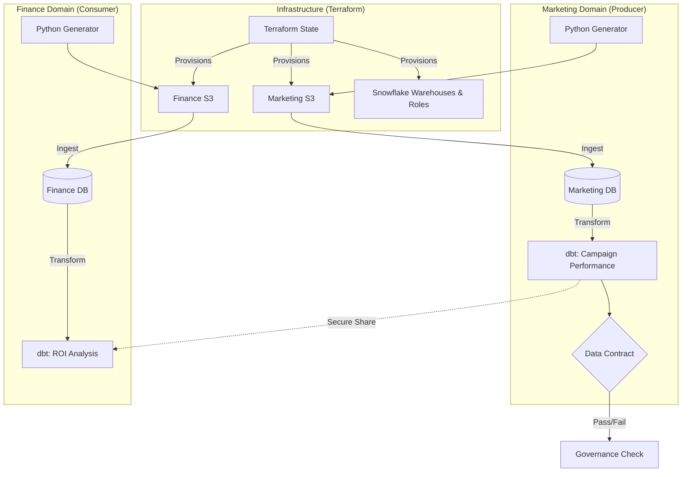

# Enterprise Data Mesh on Snowflake & AWS


A full-scale implementation of a **Data Mesh architecture** featuring decentralized domains (Marketing & Finance), automated data governance, and secure cross-domain data sharing without replication.

## 🏗️ Architecture Overview

This project moves away from the monolithic data warehouse pattern. Instead, it treats data as a product, owned by specific domains, and served securely to consumers via defined contracts.


## 🚀 Key Features

* **Infrastructure as Code (IaC):** Complete environment provisioning using Terraform (S3 Buckets, Snowflake Databases, Warehouses, RBAC Roles).
* **Decentralized Compute:** Separate Snowflake Warehouses (`MARKETING_WH`, `FINANCE_WH`) for strict FinOps cost allocation.
* **Zero-Copy Data Sharing:** Finance calculates ROI by joining local revenue data with remote marketing data, without moving or duplicating the marketing tables.
* **Automated Governance:** Python-based CI/CD gatekeeper that validates dbt models against a JSON Schema Contract before deployment.
* **Polyglot Pipelines:** Integration of Python (Data Generation, Validation), SQL (Snowflake), and Jinja (dbt).

## 🛠️ Tech Stack

| Category | Tool | Description |
| :--- | :--- | :--- |
| **Cloud** | AWS (S3, IAM) | Storage and Access Management |
| **Warehouse** | Snowflake | Standard Edition, utilizing Zero-Copy Cloning & Sharing |
| **Transformation** | dbt Core (v1.7+) | Data transformation and lineage |
| **Infrastructure** | Terraform (v1.5+) | State management and resource provisioning |
| **Language** | Python 3.9+ | Boto3, Snowflake Connector, Faker |

## 📂 Repository Structure

```text
data-mesh-project/
├── terraform/                  # IaC for AWS & Snowflake setup
├── marketing_domain/           # Producer Logic
│   ├── dbt/                    # Transformation Logic
│   └── setup_ingestion.sql     # Raw Data Loading
├── finance_domain/             # Consumer Logic
│   ├── dbt/                    # Cross-domain Join Logic
│   └── setup_finance.sql       # Access Grants & Loading
└── governance/                 # Platform Logic
    ├── contracts/              # JSON Schema Definitions
    └── validate_contract.py    # CI/CD Validation Script
```
##⚡ Quick Start

#Prerequisites

AWS Account & CLI configured

Snowflake Account (Admin Access)

Terraform & dbt installed

#1. Provision Infrastructure

Deploy the "empty shell" of the mesh using Terraform.
```text
cd terraform
terraform init && terraform apply
```

#2. Build Marketing Domain (Producer)

Generate mock click data, ingest it, and create the Data Product.
```text
python marketing_domain/generate_clicks.py
# Run SQL ingestion manually in Snowflake
cd marketing_domain/dbt && dbt run
```

#3. Build Finance Domain (Consumer)

Generate transaction data and consume the Marketing product securely.
```text
python finance_domain/generate_transactions.py
# Run SQL ingestion manually in Snowflake
cd finance_domain/dbt && dbt run
```

#4. Run Governance Check

Verify that the Marketing Data Product adheres to the contract.
```text
python governance/validate_contract.py
```

##🛡️ Security & Governance

This project enforces the Principle of Least Privilege:

Marketing Role: Can only write to MARKETING_DB.

Finance Role: Can only write to FINANCE_DB. Read access to Marketing is explicitly granted via RBAC.

Contracts: Breaking changes (e.g., column renames) are caught by the validate_contract.py script before they reach production.

##📝 License

This project is open-source and available under the MIT License.
